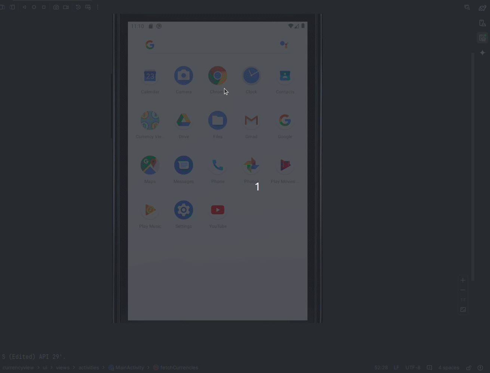

#  Aplicación de Tasas de Cambio de Divisas 



## 🌐 [](https://github.com/SamuelRocha91/kotlinExchangeRate/blob/main/README.md) [](https://github.com/SamuelRocha91/kotlinExchangeRate/blob/main/README_es.md) [](https://github.com/SamuelRocha91/kotlinExchangeRate/blob/main/README_en.md) [](https://github.com/SamuelRocha91/kotlinExchangeRate/blob/main/README_ru.md) [](https://github.com/SamuelRocha91/kotlinExchangeRate/blob/main/README_ch.md) [](https://github.com/SamuelRocha91/kotlinExchangeRate/blob/main/README_ar.md)

Esta es una aplicación de Android que permite a los usuarios ver las tasas de cambio de diferentes monedas. La aplicación utiliza la API de [API Layer](https://apilayer.com/) para obtener datos actualizados sobre las tasas de cambio.

## Funcionalidades

- Muestra una lista de monedas disponibles.
- Permite a los usuarios seleccionar una moneda y ver sus tasas de cambio.
- Manejo de errores para mejorar la experiencia del usuario.

## Requisitos previos

- Android Studio
- Gradle

## Configuración

### 1. Registro en API Layer

Antes de usar la aplicación, necesitarás registrarte en [API Layer](https://apilayer.com/) para obtener una clave de API.

### 2. Agregar la clave de la API

Después de registrarte, agrega tu clave de API al archivo `gradle.properties` de tu proyecto:

```properties
API_KEY="tu_clave_de_api"
```

### 3. Dependencias

Asegúrate de tener las siguientes dependencias en tu archivo `build.gradle`:

```groovy
dependencies {
    implementation 'com.squareup.retrofit2:retrofit:2.9.0'
    implementation 'com.squareup.retrofit2:converter-gson:2.9.0'
    implementation 'org.jetbrains.kotlinx:kotlinx-coroutines-android:1.5.2'
    implementation 'com.google.android.material:material:1.4.0'
}
```

### 4. Ejecución de la aplicación

1. Abre el proyecto en Android Studio.
2. Asegúrate de que tu dispositivo Android o emulador esté configurado correctamente.
3. Ejecuta la aplicación desde Android Studio.

## Estructura del Código

La aplicación está estructurada de la siguiente manera:

- `MainActivity`: La actividad principal que maneja la lógica de negocio y las interacciones de la UI.
- `ApiLayer`: La capa de API que utiliza Retrofit para comunicarse con la API de API Layer.
- `MainViewModel`: La clase ViewModel que gestiona el estado de la UI y realiza las llamadas a la API.
- `activity_main.xml`: El layout XML de la actividad principal.

## Otros proyectos en Kotlin:

- ☀️ [Weather App](https://github.com/SamuelRocha91/kotlinWeatherApp/blob/main/README_es.md)
- 👤 [Social Login](https://github.com/SamuelRocha91/kotlinLoginSocial/blob/main/README_es.md)
- 📜 [Virtual Menu](https://github.com/SamuelRocha91/kotlinVirtualMenu/blob/main/README_es.md)

--- 

Si necesitas más ajustes, ¡hazmelo saber!