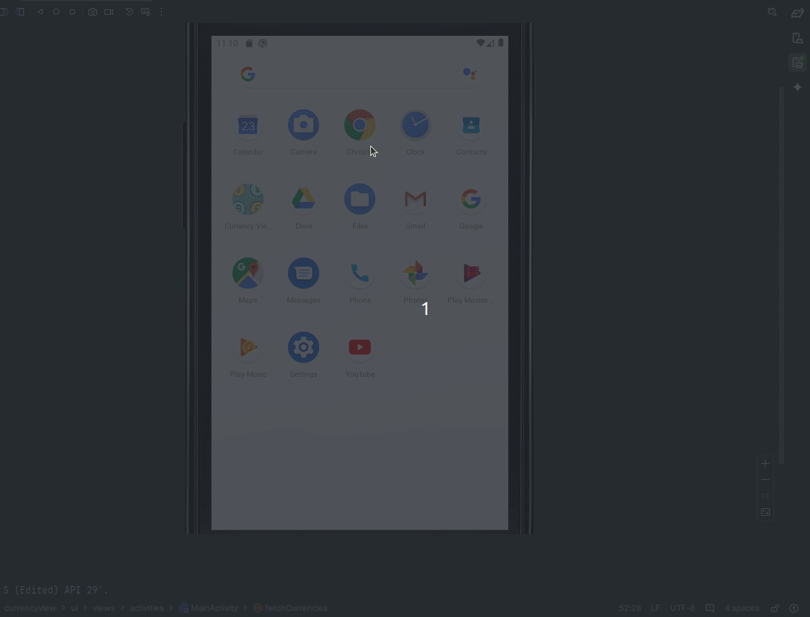

#  Currency Exchange Rates App  



## 🌠[](https://github.com/SamuelRocha91/kotlinExchangeRate/blob/main/README.md) [](https://github.com/SamuelRocha91/kotlinExchangeRate/blob/main/README_es.md) [](https://github.com/SamuelRocha91/kotlinExchangeRate/blob/main/README_en.md) [](https://github.com/SamuelRocha91/kotlinExchangeRate/blob/main/README_ru.md) [](https://github.com/SamuelRocha91/kotlinExchangeRate/blob/main/README_ch.md) [](https://github.com/SamuelRocha91/kotlinExchangeRate/blob/main/README_ar.md)

This is an Android application that allows users to view exchange rates for different currencies. The app uses the [API Layer](https://apilayer.com/) API to get updated data on exchange rates.

<details>
  <summary><h2>📋 Features</h2></summary>

  - Displays a list of available currencies.
  - Allows users to select a currency and view its exchange rates.
  - Error handling to improve user experience.

</details>

<details>
  <summary><h2>⚙️ Prerequisites</h2></summary>

  - Android Studio
  - Gradle

</details>

<details>
  <summary><h2>🛠️ Setup</h2></summary>

  ### 1. Sign up for API Layer
  Before using the app, you will need to sign up at [API Layer](https://apilayer.com/) to get an API key.

  ### 2. Add the API key
  After signing up, add your API key to your project's `gradle.properties` file:
  ```properties
  API_KEY="your_api_key"
  ```

  ### 3. Dependencies
  Make sure you have the following dependencies in your `build.gradle` file:
  ```groovy
  dependencies {
      implementation 'com.squareup.retrofit2:retrofit:2.9.0'
      implementation 'com.squareup.retrofit2:converter-gson:2.9.0'
      implementation 'org.jetbrains.kotlinx:kotlinx-coroutines-android:1.5.2'
      implementation 'com.google.android.material:material:1.4.0'
  }
  ```

  ### 4. Running the app
  1. Open the project in Android Studio.
  2. Ensure your Android device or emulator is set up correctly.
  3. Run the app from Android Studio.

</details>

<details>
  <summary><h2>📂 Code Structure</h2></summary>

  The application is structured as follows:
  - `MainActivity`: The main activity that handles business logic and UI interactions.
  - `ApiLayer`: The API layer that uses Retrofit to communicate with the API Layer.
  - `MainViewModel`: The ViewModel class that manages the UI state and makes API calls.
  - `activity_main.xml`: The XML layout for the main activity.

</details>

<details>
  <summary><h2>📁 Other Kotlin Projects</h2></summary>

  - ☀️ [Weather App](https://github.com/SamuelRocha91/kotlinWeatherApp/blob/main/README_en.md)
  - 👤 [Social Login](https://github.com/SamuelRocha91/kotlinLoginSocial/blob/main/README_en.md)
  - 📜 [Virtual Menu](https://github.com/SamuelRocha91/kotlinVirtualMenu/blob/main/README_en.md)

</details>
